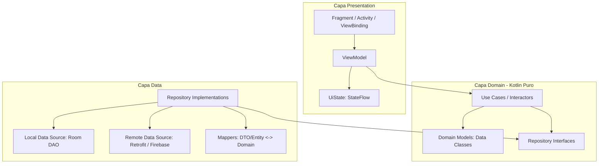

# Guía de Arquitectura y Migración a Kotlin — AgroSmart

Este documento establece los estándares, convenciones y mejores prácticas de **Clean Architecture + MVVM** utilizando **Kotlin** para el desarrollo y la migración progresiva del proyecto **AgroSmart**. Todos los agentes y desarrolladores deben adherirse a estas directrices.

---

## 1. Visión y Objetivos de la Migración

El objetivo principal es migrar la base de código de **Java 11 legacy** hacia **Kotlin moderno**, resolviendo los acoplamientos técnicos detectados:
* Reemplazar `CompletableFuture`, `Callbacks` y `new Thread()` por **Coroutines y Kotlin Flow**.
* Reemplazar **MongoDB Realm Java (EOL)** por **Room Database**.
* Introducir **Hilt** para inyección de dependencias y eliminar instanciaciones manuales con `new`.
* Desacoplar el núcleo de negocio (**Domain**) de dependencias de Android y librerías de persistencia.
* Adoptar **StateFlow** y **UI State unidireccional (UDF)** en la capa de presentación.

---

## 2. Estructura de Capas (Clean Architecture)

El flujo de dependencias siempre apunta **hacia adentro**:  
`Presentation` $\rightarrow$ `Domain` $\leftarrow$ `Data`



---

### 2.1. Capa de Dominio (`domain`) — El Núcleo Puro

La capa de dominio representa la lógica de negocio y las reglas del sistema AgroSmart.
* **Regla estricta:** Es **Kotlin puro**. Está terminantemente **PROHIBIDO** importar paquetes de `android.*`, `io.realm.*`, `androidx.*`, `com.google.firebase.*`, o `retrofit2.*`.
* **Componentes:**
  1. **Modelos de Dominio (`domain/models/`):**
     * Deben ser `data class` inmutables (`val`).
     * No deben extender de ninguna clase de persistencia ni contener anotaciones de base de datos o serializadores (sin `@PrimaryKey`, sin `@SerializedName`, sin `RealmObject`).
     ```kotlin
     // Bien
     data class Crop(
         val id: String,
         val name: String,
         val description: String,
         val harvestTime: String,
         val type: String
     )
     ```
  2. **Interfaces de Repositorio (`domain/repository/`):**
     * Definen contratos de operaciones con funciones `suspend` y `Flow`.
     * Nunca reciben ni devuelven tipos de vista (`Fragment`, `View`, etc.).
     ```kotlin
     interface CropRepository {
         suspend fun getCrops(): Result<List<Crop>>
         fun getCropByName(name: String): Flow<Crop?>
     }
     ```
  3. **Casos de Uso (`domain/usecase/`):**
     * Cada caso de uso debe representar una única acción de negocio (Principio de Responsabilidad Única).
     * Implementar la convención `operator fun invoke(...)`.
     ```kotlin
     class GetCropsUseCase @Inject constructor(
         private val cropRepository: CropRepository
     ) {
         suspend operator fun invoke(): Result<List<Crop>> {
             return cropRepository.getCrops()
         }
     }
     ```

---

### 2.2. Capa de Datos (`data`) — Fuentes de Información y Mapeos

Se encarga de interactuar con el almacenamiento local (Room), APIs remotas (Retrofit) y servicios en la nube (Firebase).
* **Componentes:**
  1. **DTOs y Entidades Locales:**
     * `Entity` (Room): Modelos para la base de datos local SQLite con `@Entity` y `@PrimaryKey`.
     * `Dto` (Remote): Modelos para Retrofit con anotaciones `@SerializedName` o `@JsonClass`.
  2. **Mappers (`data/mapper/`):**
     * Separación total entre capas mediante funciones de extensión.
     ```kotlin
     fun CropEntity.toDomain(): Crop = Crop(
         id = id,
         name = name,
         description = description,
         harvestTime = harvestTime,
         type = type
     )

     fun Crop.toEntity(): CropEntity = CropEntity(
         id = id,
         name = name,
         description = description,
         harvestTime = harvestTime,
         type = type
     )
     ```
  3. **Implementación de Repositorios (`data/repository/`):**
     * Orquestan fuentes locales y remotas.
     * Gestionan los dispatchers de corrutinas (`Dispatchers.IO`).
     * Convierten excepciones de bajo nivel en tipos predecibles del dominio (`Result<T>`).
     ```kotlin
     class CropRepositoryImpl @Inject constructor(
         private val localDataSource: CropDao,
         private val remoteDataSource: CropRemoteService,
         private val ioDispatcher: CoroutineDispatcher = Dispatchers.IO
     ) : CropRepository {
         override suspend fun getCrops(): Result<List<Crop>> = withContext(ioDispatcher) {
             runCatching {
                 val remoteCrops = remoteDataSource.fetchCrops()
                 localDataSource.insertAll(remoteCrops.map { it.toEntity() })
                 localDataSource.getAllCrops().map { it.toDomain() }
             }
         }
     }
     ```

---

### 2.3. Capa de Presentación (`presentation`) — MVVM y Estado Unidireccional (UDF)

Se encarga de mostrar la información al agricultor y reaccionar a las interacciones del usuario.
* **Componentes:**
  1. **UI State (Inmutable):**
     * Usar `sealed interface` para representar los estados posibles de una pantalla (Loading, Success, Error).
     ```kotlin
     sealed interface DetectionUiState {
         object Idle : DetectionUiState
         object Loading : DetectionUiState
         data class Success(val diagnosis: DiagnosisHistory, val recommendation: String) : DetectionUiState
         data class Error(val message: String) : DetectionUiState
     }
     ```
  2. **UI Events / Side Effects (Un solo disparo):**
     * Para eventos de una sola vez (mostrar Snackbar, Toast, navegar a otra pantalla), usar `Channel<UiEvent>` o `SharedFlow`.
  3. **ViewModel (`presentation/viewmodels/`):**
     * Inyectado con `@HiltViewModel`.
     * Expone un `StateFlow<UiState>` público e inmutable.
     * Solo se comunica con los **Casos de Uso** (no con repositorios directamente ni con clientes HTTP).
     * Nunca debe contener referencias a `Context`, `View`, `Fragment` o `Activity`.
     ```kotlin
     @HiltViewModel
     class DetectionViewModel @Inject constructor(
         private val detectDeficiencyUseCase: DetectDeficiencyUseCase,
         private val getRecommendationUseCase: GetRecommendationUseCase
     ) : ViewModel() {

         private val _uiState = MutableStateFlow<DetectionUiState>(DetectionUiState.Idle)
         val uiState: StateFlow<DetectionUiState> = _uiState.asStateFlow()

         fun processImage(bitmap: Bitmap) {
             viewModelScope.launch {
                 _uiState.value = DetectionUiState.Loading
                 val result = detectDeficiencyUseCase(bitmap)
                 result.fold(
                     onSuccess = { diagnosis ->
                         _uiState.value = DetectionUiState.Success(diagnosis, "")
                     },
                     onFailure = { error ->
                         _uiState.value = DetectionUiState.Error(error.localizedMessage ?: "Error desconocido")
                     }
                 )
             }
         }
     }
     ```
  4. **Fragment / Vista (`presentation/ui/`):**
     * Recolecta el estado usando `repeatOnLifecycle` para evitar memory leaks y consumo innecesario de recursos en segundo plano.
     ```kotlin
     viewLifecycleOwner.lifecycleScope.launch {
         viewLifecycleOwner.repeatOnLifecycle(Lifecycle.State.STARTED) {
             viewModel.uiState.collect { state ->
                 renderState(state)
             }
         }
     }
     ```

---

## 3. Guía de Reemplazo Tecnológico en AgroSmart

| Componente Legacy (Java) | Alternativa Moderna (Kotlin) | Justificación |
| :--- | :--- | :--- |
| `CompletableFuture<T>` / `Callbacks` | **Coroutines (`suspend`) y `Flow<T>`** | Código secuencial, estructurado, cancelación cooperativa y control de hilos nativo. |
| `LiveData<T>` | **`StateFlow<T>` y `SharedFlow<T>`** | API multiplataforma de Kotlin, soporte completo para operadores de flujo, inmutabilidad garantizada. |
| **MongoDB Realm Java** | **Room Database** | Estándar oficial de Android Jetpack, 100% compatible con Flow y Coroutines, soporte activo y migraciones verificadas en compile-time. |
| Instanciación con `new` | **Hilt (Dagger)** | Inyección de dependencias estándar de Android, elimina acoplamientos y facilita tests con dobles/mocks. |
| `UnsafeOkhttpClient` (SSL bypass) | **Network Security Config oficial** | Los certificados autofirmados o de testing deben manejarse mediante `res/xml/network_security_config.xml`, nunca con `TrustAllX509TrustManager` en producción. |
| Inferencia ML en hilos manuales (`Thread`) | **Coroutines con `Dispatchers.Default`** | Evita fugas de memoria del contexto de la Activity/Fragment y controla el pool de hilos de CPU eficientemente. |

---

## 4. Estrategia de Migración Paso a Paso

Para mantener la app compilando y ejecutable durante la transición, la migración debe ser **progresiva y por módulos verticales**:

1. **Paso 1: Configuración de Base y DI (Hilt):**
   * Configurar `@HiltAndroidApp` en una clase `Application`.
   * Proveer dependencias globales (Firebase, Retrofit, Database) en `@Module` de Hilt.
2. **Paso 2: Migrar Capa Domain a Kotlin:**
   * Convertir modelos a `data class` puras (eliminando `extends RealmObject`).
   * Definir interfaces de repositorios con `suspend fun`.
   * Crear casos de uso con `operator fun invoke()`.
3. **Paso 3: Migrar Capa Data (Room + Mappers):**
   * Crear tablas `@Entity` y DAOs en Room para reemplazar gradualmente las colecciones de Realm (`DiagnosisHistory`, `Crop`, etc.).
   * Implementar mappers bidireccionales (`toDomain`, `toEntity`).
   * Migrar servicios de Retrofit a funciones `suspend`.
4. **Paso 4: Migrar Capa Presentation (MVVM + StateFlow):**
   * Convertir ViewModels a Kotlin con `@HiltViewModel` y `StateFlow`.
   * Actualizar Fragments para recolectar flujos con `viewLifecycleOwner.lifecycleScope`.
5. **Paso 5: Limpieza:**
   * Remover el plugin `realm-android` y librerías obsoletas de `libs.versions.toml`.

---

## 5. Convenciones de Código y Nomenclatura

* **Archivos Kotlin:** Cada archivo debe tener un único propósito claro.
* **Nombres de Clases:**
  * Caso de Uso: `Verbo` + `Objeto` + `UseCase` (ej. `GetDiagnosisHistoryUseCase`, `AnalyzeCropImageUseCase`).
  * Repositorio (Interfaz): `Objeto` + `Repository` (ej. `FertilizerRepository`).
  * Repositorio (Implementación): `Objeto` + `RepositoryImpl` (ej. `FertilizerRepositoryImpl`).
  * Entidad Room: `Objeto` + `Entity` (ej. `DiagnosisHistoryEntity`).
  * DTO Red: `Objeto` + `Dto` / `Response` / `Request` (ej. `RecommendationRequestDto`).
  * Estado de UI: `Pantalla` + `UiState` (ej. `HomeUiState`).
* **Manejo de Nulos:** Evitar el operador `!!` (not-null assertion). Preferir `?.let`, elvis operator `?:` o validaciones tempranas con `requireNotNull()`.
* **Testing:** Usar `kotlinx.coroutines.test.runTest` y `Turbine` para verificar emisiones de `StateFlow`.
